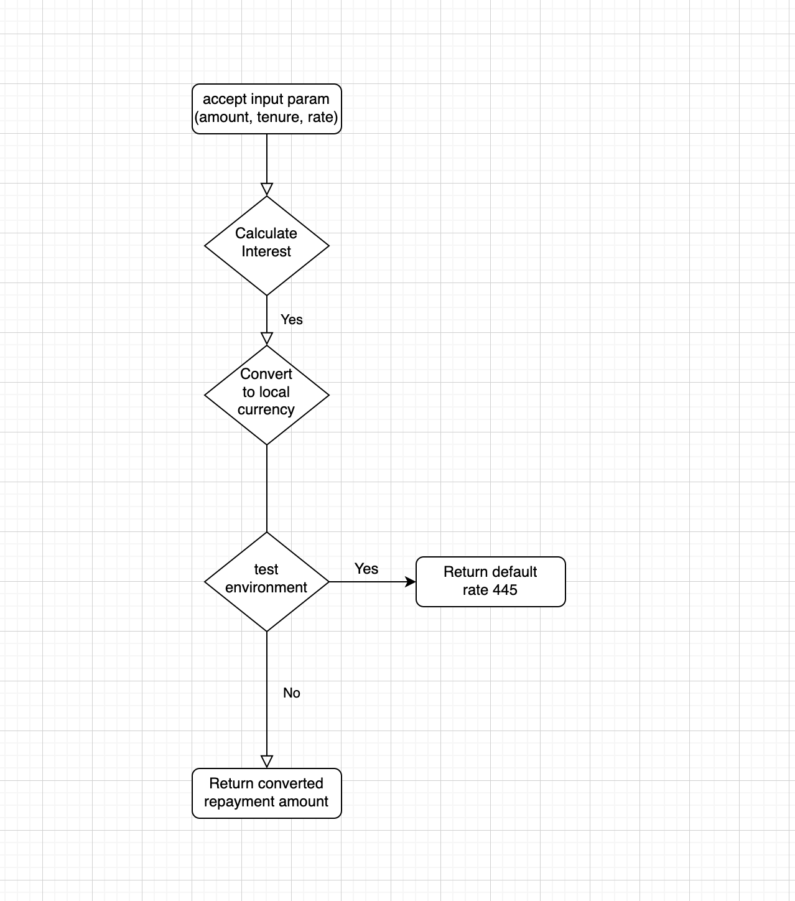
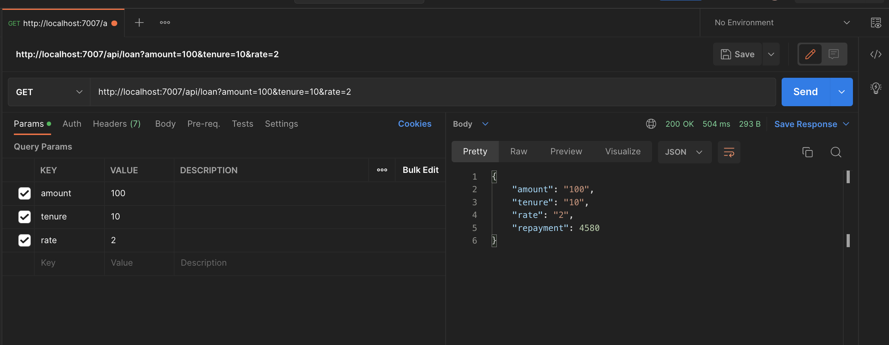

# FLW TEST

## Diagrams:
Flowchart for loan calculation


Endpoint request sample diagram


## Running tests:
To run all test cases, run the command:
```bash
$ npm install && npm run test
```


## How to setup and run loan calculator locally:
Install all dependencies by running:
```bash
$ npm install
```

Build the app by running command:
```bash
$ npm run build-ts
```

Start the app by running:
```bash
$ npm run start
```

App will be listening on port 7007


## How to run string comparison function:
```bash
$ npx ts-node src/compareString.ts or npm run test
```
